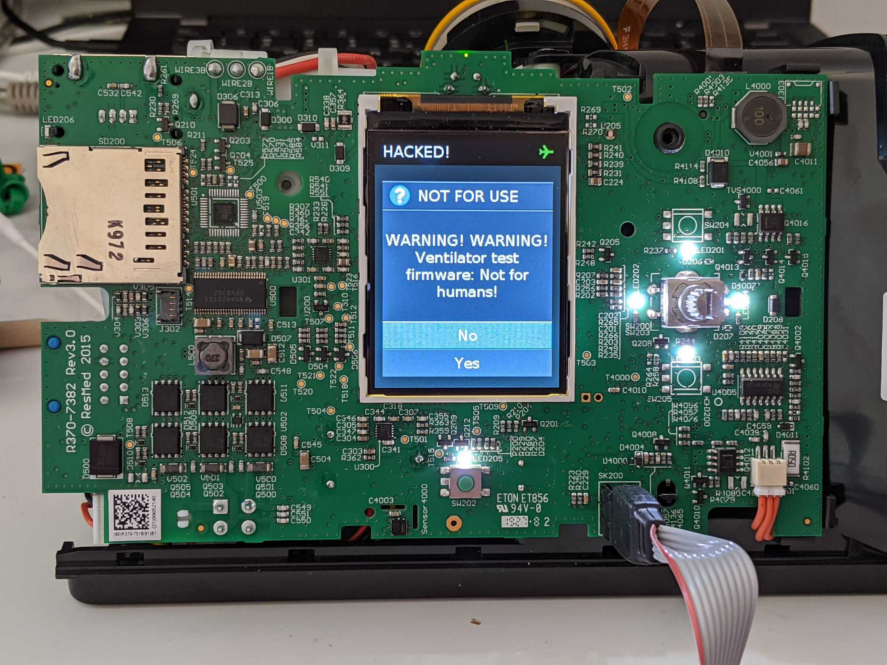

# Jailbreaking CPAP machines to make temporary ventilators

This is the README for the internals of ResMed CPAP jailbreak works;
for a high-level overview, see [airbreak.dev](https://airbreak.dev).

This tree does not contain any files that are copyrighted by ResMed.
You must have a device to extract the firmware from, which is then patched,
and the modified version is re-flashed.

You will need the tools described in [docs/installation](docs/instalation.md).
The `stubs.S` file that has been committed is for SX567-0401. Flashing it on
a different version will likely cause problems.

Extensions can either replace existing functions at fixed addresses,
or can use some of the unused space in the image.
The `Makefile` has a short explanation of how to do this; the
`patch-airsense` file will also need to be updated to patch the
binary file into the firmware.

# Helpful GDB commands:

Start `gdb`, connect to the OpenOCD server and disassemble the current address:
```
gdb-multiarch -iex 'target remote localhost:3333'
display/i $pc
```

Reboot the device and halt before running any code:
```
mon reset halt
```

Unlock the STM32 and flash the new firmware into it:
```
mon stm32f2x options_write 0 0x2c ; reset halt ;  flash write_image erase stm32-unlocked.bin 0x8000000
```

Read the Therapy Manager floating point variables, or a specific one like the target
pressure (`0x2d`):
```
x/200f 0x2000e948
x/f (0x2000e948 + 4 * 0x2a)
```

Read the Therapy Manager integer variables, or a specific one like the current mode (`0x6F`):
```
x/200xw 0x2000e750
x/xw (0x2000e750 + 4 * 0x6F)
```


