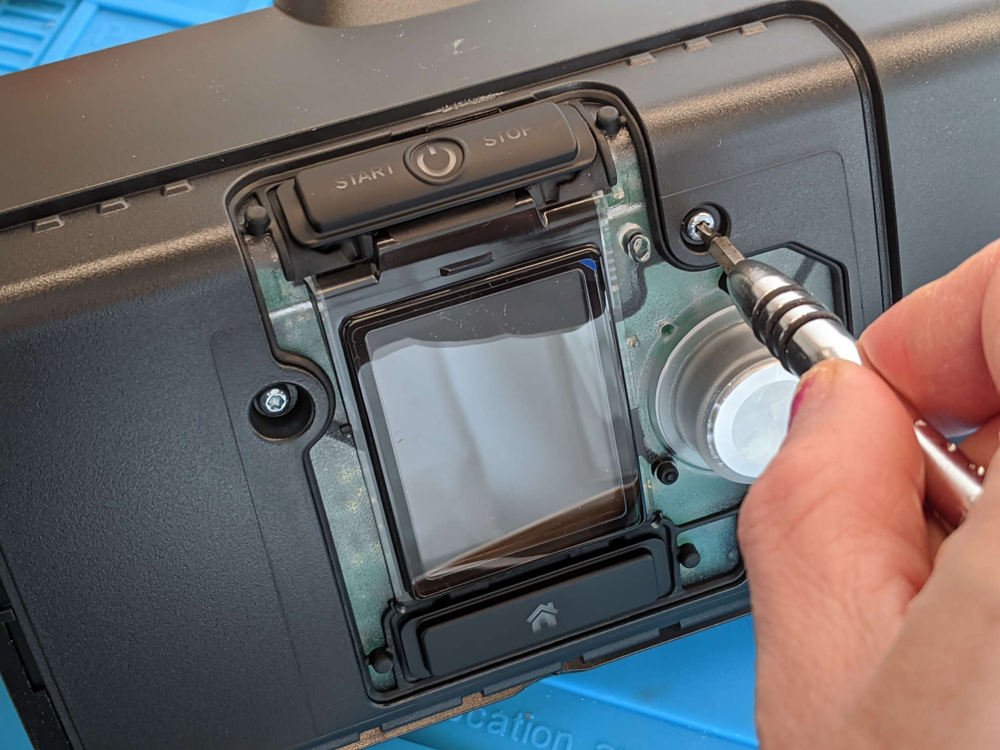
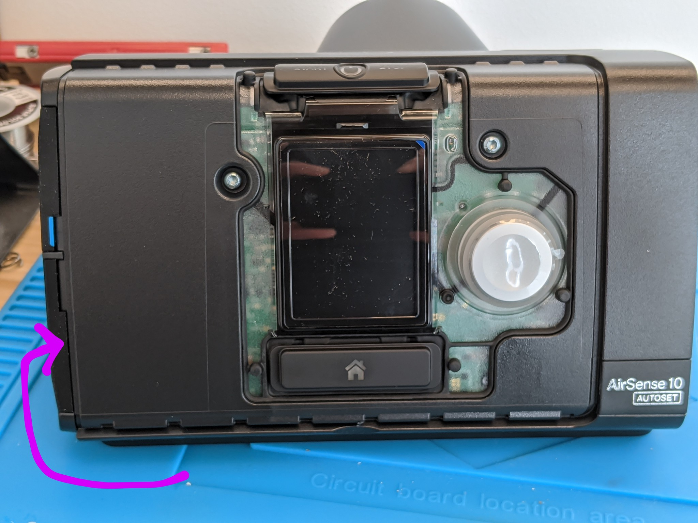
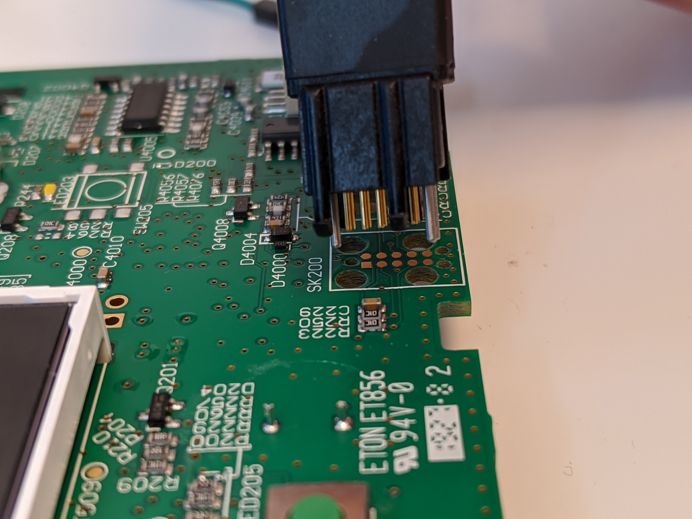
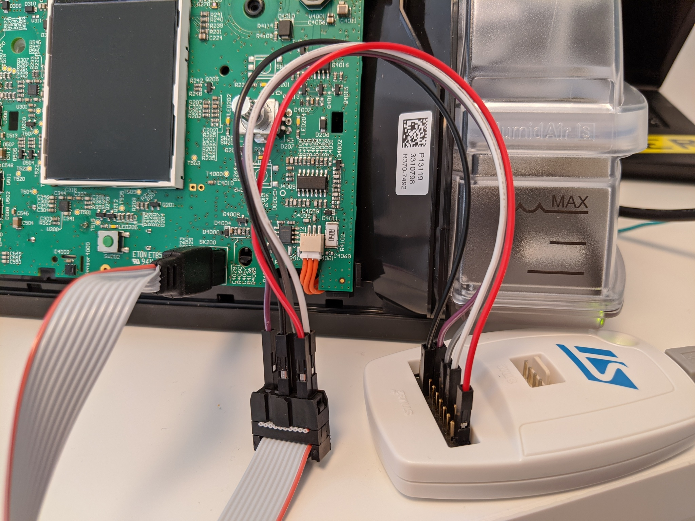

# Disassembly

In order to dump and replace the device firmware, we need to access the programming port. Unforunately it is inside the machine so it requires some disassembly to reach.

### Tools

You will need the following:

* Torx T15
* [ST-Link/V2 STM32 programmer](https://www.digikey.com/product-detail/en/stmicroelectronics/ST-LINK-V2/497-10484-ND/2214535) or clone
* [TC2050-IDC](https://www.digikey.com/product-detail/en/TC2050-IDC/TC2050-IDC-ND/2605366) or [TC2050-ICD-NL](https://www.digikey.com/product-detail/en/tag-connect-llc/TC2050-IDC-NL/TC2050-IDC-NL-ND/2605367) programming adapter
* 4 male-female 0.1" jumpers
* Computer with [OpenOCD](http://openocd.org/) and some Unix familiarity
* `arm-none-eabi-gcc` to compile extensions (not necessary to unlock the device)

It is difficult but possible to solder directly to the PCB, which relaxes the requirement for the jumpers and programming adapter. For more information on this, see the [list of useful test points](info/testpoints.md).

First you'll need a Torx T15 driver to remove unscrew the three faceplate screws.

<!--  -->

The bottom latches need to be pried open with a flat head or a spudger.

The knob needs to be pulled firmly straight away from the board to remove it, which will allow
the gasket to be removed.  Be careful while popping it off the start button on the top of the device.
It is not necessary to remove the circuit board from the device.

## Wiring

[TC2050-IDC](https://www.digikey.com/product-detail/en/TC2050-IDC/TC2050-IDC-ND/2605366)
is useful for development since it has legs
that attach to the board.  For higher throughput flashing the
[TC2050-ICD-NL](https://www.digikey.com/product-detail/en/tag-connect-llc/TC2050-IDC-NL/TC2050-IDC-NL-ND/2605367)
is easier to hookup, but requires someone to hold it in place while the
device is reflashed with custom firmware.  The pinout of this port is not
the usual 10-pin ARM debug header; it combines the programming pins for
the STM32 that is the main controller, the auxillary STM8, and the PMIC.

Board footprint layout (you don't need this unless you're soldering to
the board):

| Function 		| Pin | Pin | Function |
| ---			| --- | --- | --- |
| `STM32_VDD`		| 1 (square) | 2 | `STM32_NRST` |
| `STM32_SWDIO`		| 3   | 4   | `STM8_SWIM` |
| `STM8_VDD`		| 5   | 6   | `PMIC_TDI` |
| `STM32_SWCLK`		| 7   | 8   | `STM8_TLI` |
| `GND`			| 9   | 10  | `PMIC_TDO` |

The [ST-Link/V2 programming
device](https://www.digikey.nl/product-detail/en/stmicroelectronics/ST-LINK-V2/497-10484-ND/2214535)
is used for flashing and debugging the code on the STM32.  It has a
different pinout from the TC2050 cable, so it is necessary to use some
male-female 0.1" jumpers to connect the four STM32 programming pins on the
TC2050 to the STlink.

TC2050 ribbon cable pinout:

| Function 		| Pin | Pin | Function |
| ---			| --- | --- | --- |
| **`STM32_VDD`**	| 1 (red) | 3 | **`STM32_SWDIO`** |
| `STM8_VDD`		| 5   | 7   | **`STM32_SWCLK`** |
| **`GND`**		| 9   | 10  | `PMIC_TDO` |
| `STM8_TLI`		| 8   | 6   | `PMIC_TDI` |
| `STM8_SWIM`		| 4   | 2   | **`STM32_NRST`** |

STlink-V2 pinout:

| Function	 	| Pin | Pin | Function |
| ---			| --- | --- | --- |
| **`STM32_VDD`**	|  1  |  2  | NC |
| NC			|  3  |  4  | NC |
| NC			|  5  |  6  | NC |
| **`STM32_SWDIO`**	|  7  |  8  | NC |
| **`STM32_SWCLK`**	|  9  | 10  | NC |
| NC			| 11  | 12  | NC |
| NC			| 13  | 14  | NC |
| **`STM32_NRST`**	| 15  | 16  | NC |
| NC			| 17  | 18  | NC |
| NC			| 19  | 20  | **`GND`** |

!!! Warning
	A genuine ST-Link programmer uses the STM32_VDD pin to detect the target voltage, not to provide power. Connecting a generic programmer or a Raspberry Pi with this pin configuration will cause the programmer to be back-powered through the AirSense PCB.

	**If you are using a SWD programmer other than the ST-Link, do not hook up STM32_VDD to your 3.3V pin or you may risk damaging your board, programmer, or both!**

Okay, now you're ready to [flash the firmware!](firmware.md)
