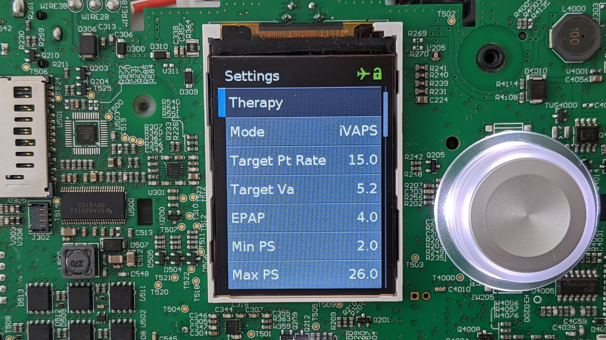

# Firmware 

### Connecting to Device

!!! Note
	If you are using Windows, the steps in this section will be slightly different. Please see the [Windows guide](info/windows.md) for more information.

We are going to use the open-source OpenOCD debug interface to access the device.  

First, make sure [this repository](https://github.com/osresearch/airbreak) is cloned and set to your current working directory.

Make sure your programmer is [attached to the PCB](/disassembly/#wiring), then start OpenOCD.

```sh
sudo openocd -f interface/stlink.cfg -c 'tcl/airsense.cfg'
```

If your device is connected properly, you should see a bunch of output, ending with:
```sh
Info : stm32f4x.cpu: hardware has 6 breakpoints, 4 watchpoints
```

In another terminal, connect to the OpenOCD server:

```sh
telnet localhost 4444
```

Once your OpenOCD console is successfully connected, you can continue to the next step.

## Dumping Vendor Firmware

!!! Warning
	This step is mandatory. Each subsequent step requires an original copy of the device firmware
	to be present in the working directory. With an original copy of the firmware, the device can always be
	restored to factory settings. If you lose the original firmware, you risk bricking your device!

Type `dump` into the OpenOCD console.


## Building Alternate Firmware


## Flashing


With the device powered up and the stlink connected to the computer, run [OpenOCD](http://openocd.org/)
to initialize the programmer and fetch the existing firmware (should take about 10 seconds):

```
sudo openocd \
	-f interface/stlink.cfg \
	-f target/stm32f4x.cfg \
	-c 'flash read_bank 0 stm32.bin'
```

Patch this extracted firmware with the script [`patch-airsense` script](patch-airsense)
that will unlock the vendor modes and configuration bits:

```
./patch-airsense stm32.bin stm32-unlocked.bin
```

Now reflash the device with the modified firmware:

```
sudo openocd \
	-f interface/stlink.cfg \
	-f target/stm32f4x.cfg \
	-c 'stm32f2x options_write 0 0x2c' \
	-c 'reset halt' \
	-c 'flash write_image erase stm32-unlocked.bin 0x8000000' \
	-c 'reset run' \
```

## Testing



The device should reboot and if you enter the clinician menu (hold down the `Home` button while pushing on the knob
for three seconds), you should be able to select from all of the vendor modes, including iVAPS and ST.
These modes should allow the CPAP device to immediately be used according to the Mt Sinai BiPAP protocol.

The flashing is a one-time operation.  The programmer can be unplugged and moved to another device.

### Restoring the vendor firmware


Restoring the old firmware is possible; there are some RTC variables that need to be adjusted.
Script to be provided.

