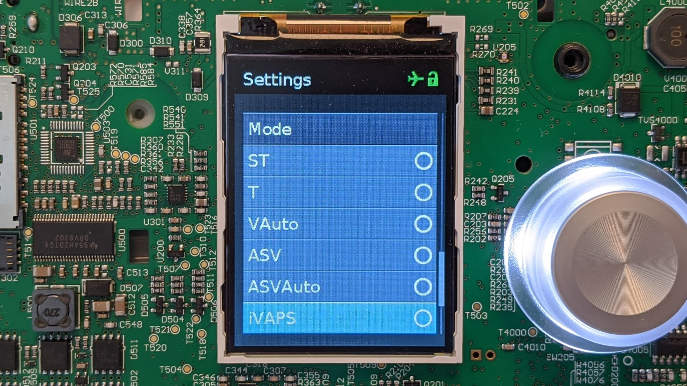
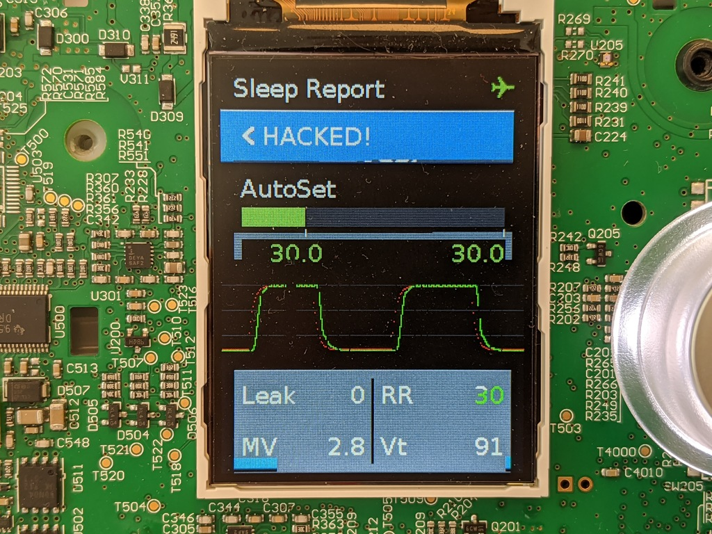

# Jailbreak your CPAP machine with Airbreak

In light of the COVID-19 crisis and resultant
shortage of medical equipment, [hospitals have developed protocols for
using BiPAP (BIlevel Positive Airway Pressure) machines as non-invasive
ventilators](https://health.mountsinai.org/blog/mount-sinai-turns-hundreds-of-machines-for-sleep-apnea-into-hospital-ventilators-shares-instructions-worldwide/),
the [FDA has approved the use of these modified BiPAP devices as ventilators](https://www.fda.gov/media/136702/download),
and [several groups](https://github.com/PubInv/covid19-vent-list)
are currently working on ventilator designs that involve a
converted BiPAP.  However, CPAP (Constant Positive Airway Pressure) devices
are cheaper, more widely available, and similar both electrically
and mechanically.  Unfortunately, they are lacking in some features that
the physicians require and, according to their manufacturer, CPAP
machines "[*would require significant rework in order to function as
a ventilator*](https://www.resmed.com/en-us/covid-19/)".

What we have done it to "*jailbreak*" the the Airsense 10 CPAP
machine, a common, low-cost sleep therapy device
intended to treat sleep apnea, so that it is possible to run additional
tasks on the device. These new tasks add the features and adjust the range of
parameters that make it possible to use the device as a temporary ventilator.
This can help ease the shortage until more real ventilators are available.

Our changes bring the Airsense S10 to near feature parity with BiPAP
machines from the same manufacturer, boost the maximum pressure output
available, and provide a starting point to add more advanced emergency
ventilator functionality.

## Disclaimer

While we are consulting with doctors to validate that the modified
firmware works as intended, the codebase in its current form should
be considered a **proof of concept** and is
**not intended for use in a life-support capacity**.
Additional equipment like viral filters are also required.
Please see the [FAQ](#faq) for more information.

No IP belonging to device manufacturers is hosted in this repository,
nor will it be accepted as a pull request.

## Major features
* Adds a Pressure Control Ventilator (PCV) mode that oscillates between high and low pressure at a configurable breathing rate (stock firmware supports only a single pressure, with no breath rate control).
* Allows maximum pressure to be increased to 30 cm H2O, as required by clinical protocols (stock firmware is limited to 20cm H2O).
* Allows smooth rapid pressure change rates for respiration rates up to 30 breaths per minute (stock firmware changes pressure at less than 1 cm/sec).
* Unlocks all of the vendor modes and tunable configuration parameters, including ST and iVAPS modes present in the firmware.
* Provides access to all of the sensors (flow, pressure, temperature, tidal volume, minute ventilation, etc).
* Displays real-time graphs on the screen to show an immediate history of sensor data.

## Development features
* Visual and audible alarms when flow stoppage or leakage rates are detected.
* Closed loop air volume control with backup respiration rates and supplemental O2.
* GPIO interface with other systems.
* Display statistics in conformance with [Rapidly Manufactured Ventilator Standards](https://docs.google.com/spreadsheets/d/17EJ9TN6O1wqP4c-lIn5hbmuMRrto7M_KXHf17zjNSLk/edit#gid=704151435).

# FAQ

## What's the difference between the CPAP and BiPAP machines?

The Airsense 10 that we have modified is a low cost sleep therapy device
that provides a *Constant* Positive Air Pressure to help with sleep apnea and
other disorders.  This CPAP mode applies constant pressure to the lungs,
but it does not ventilate, or let air move in and out of the lungs.

The BiPAP machines are more capable devices to treat sleep apnea
and COPD that provide *Bi-level* Positive Airway Pressure.  Bi-level
pressure *triggers* on patient breaths, applying higher pressure when
the patient tries to breathe in, and a lower pressure when the patient
tries to exhale.  This is what's called a *support* mode, which provides
additional pressure support to a patient's natural breathing.

These differences apply to the devices as they function **out of the box**.
Our work indicates that the actual difference between a low-end
CPAP device and a high-end iVAPS device is just a **software upgrade**.
The CPAP machines have many of the same sensors as the more
expensive models, and the Airsense 10 CPAP devices include in their
firmware all of the other modes, such as iVAPS and BiPAP-ST.
When we unlock that mode in software, the CPAP device functions like a
much more capable and expensive iVAPS device.

This idea, that the difference between CPAP and BiPAP machines is a
*software* change rather than a *hardware* change, is at the root of
our work.  If the common, highly distributed CPAP devices could have a
software upgrade that turns them into iVAPS or BiPAP-ST devices capable
of ventilating COVID patients, that would be a huge boon to the hospitals
and health care workers around the world who are struggling with a lack
of ventilators or alternatives to treat the influx of COVID patients.

Adding a homebrew function to the existing firmware that alternate
between pressures with a configurable delay allows the CPAP to effectively
function as a Pressure Control Ventilator (PCV) for sedated patients.
Enabling the vendor provided iVAPS mode,
along with [further customization and new extensions](info/extensions),
should make the devices even more flexible and suitable for clinical use.

## Can jailbroken CPAP devices be used to treat COVID patients?

We want to be very clear here: this modified firmware should **not** be
flashed on CPAP machines and used to treat COVID patients immediately.
The firmware that we've developed is an effective demonstration of
the capability, and while it has been [reviewed and validated by expert
researchers, biomedical engineers, and clinical pulmonologists](evaluation), it has
not yet been put through FDA approval.  Additionally, the
[Mt Sinai's protocols for off-label non-invasive ventilation](https://health.mountsinai.org/wp-content/uploads/sites/14/2020/04/NIV-to-Ventilator-Modification-Protocol-v1.02-for-posting.pdf)
require additional modifications such as viral filter and remote control
before the machines would be ready for clinical use.

## Could hacked machines alleviate the shortage of ventilators?
If the manufacturers developed their own firmware updates, or the FDA
approves our jailbroken firmware, this could have an extremely large role
in bridging the ventilator shortage gap.
There are millions of unused or underutilized CPAP and BiPAP devices sitting in
closets in America, and roughly another 500,000 units in warehouses in
the country.  These devices can be used as an alternate ventilator, for
low-resource hospitals who are still waiting for the hospital ventilators
to arrive.

## Could homebrew firmware go through FDA approval?

If there were no other option, our firmware could go through FDA approval,
but we believe that the best route for rolling out these upgrades is
to work with the manufacturers to use their resources to validate and
distribute these upgrades safely and at scale.  There are three main
factors at play here:

* The first is a regulatory/safety one:  Under the recently-released
FDA guidance on hardware and software modification of CPAP and BiPAP
devices to treat COVID patients, the manufacturer has a carte blanche
to release an updated version of their firmware for their own devices
without requiring explicit FDA approval -- they are in the best position
from a technical, expertise, safety and regulatory perspective.

* The second is a practical one:  There are many different models of
CPAP and BiPAP devices, and reverse-engineering is a slow and painful
process. We modified the firmware on the most common model of CPAP in
America in about a week, but to get lots of ventilators quickly, you'd
need a firmware modification for every mode of CPAP.
What we've found in our work is that the work needed
for the manufacturer to implement these upgrades is pretty minimal --
the manufacturer has access to the source code, to the schematics,
and to the engineers who are intimately familiar with physiology and
safety standards.  We've found that, in many cases, the bulk of the
work has already gone through FDA approval, like the iVAPS menu that
is in the firmware on the ResMed Airsense device show above.  Even if other
manufacturers had not written a line of code for their CPAP models, the
simple pressure-control ventilator mode that we were able to implement
is very simple to develop, is designed to work on every CPAP device in
existence, and would be a very low technology and regulatory barrier
for manufacturers who have the right people and resources.

* The third is related to making these jailbreaks at scale:  We could take
in every unused CPAP device in the country, [unscrew the case](disassembly)
and [re-flash the firmware](firmware).  It's slow and expensive but could
be solved with lots and lots of people.  The thing is, of the 8 million
CPAPs in the country, almost all 5 million shipped over the last 3 years
have a cellular IoT connection that is always on, reporting back usage
information to the doctors and the insurance companies.  That cellular
connection also has over-the-air upgrade capability that can only be
accessed from within the IT infrastructure of the device manufacturers.
This is a big deal -- it means that they can selectively upgrade, by
serial number, specific units to function as ventilators, without having
to open them up -- it can all work over the air.

## So what's the point?

What our firmware does is show that it is possible to re-program these
devices in a way that doctors can use to effectively ventilate COVID
patients. We have been able to confirm the functionality of the devices
in instrumented patient circuits operated by experts in pulmonological
measurement. And there are doctors who agree that, if they had an
FDA-approved machine that could that can do what these machines are doing,
then they could use them to clinically ventilate COVID patients in an ICU.

We do have a path to get this firmware through FDA, and we would apply for
FDA approval under the Emergency Use Authorization if the manufacturers
absolutely refused to cooperate, but the safest and best path is for
the manufacturers to enable this upgrade on their own.

Separately from the very pressing COVID issues, Airbreak allows
CPAP device owners to write their own [extensions to customize their
devices for their needs](info/extensions), similar to what the [Magic
Lantern](https://magiclantern.fm) firmware does for cameras.  They can
add features like the on-screen graphs shown above, or integrate external
systems through the expansion port.  Additionally, these tools allow
the owners and users to gain a better understand their own therapy by
gaining access to the sensors on the device.

# More details

* [Clinical evaluation](evaluation)
* [Disassembly and wiring instructions](/disassembly)
* [Firmware flashing guide](/firmware)
* [Writing extensions](info/extensions)
* [github.com/osresearch/airbreak](https://github.com/osresearch/airbreak)
* [info@airbreak.dev](mailto://info@airbreak.dev)

